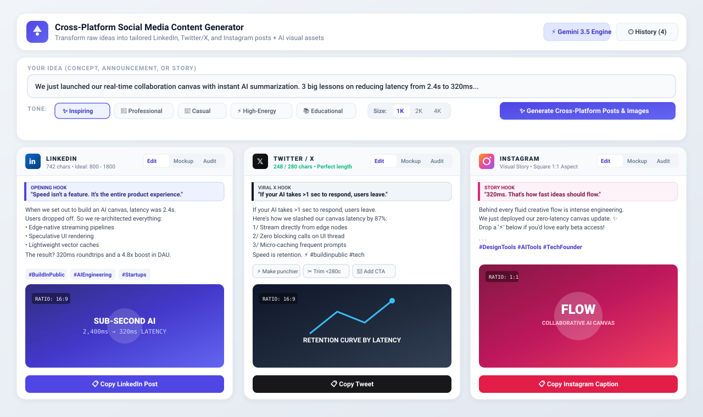
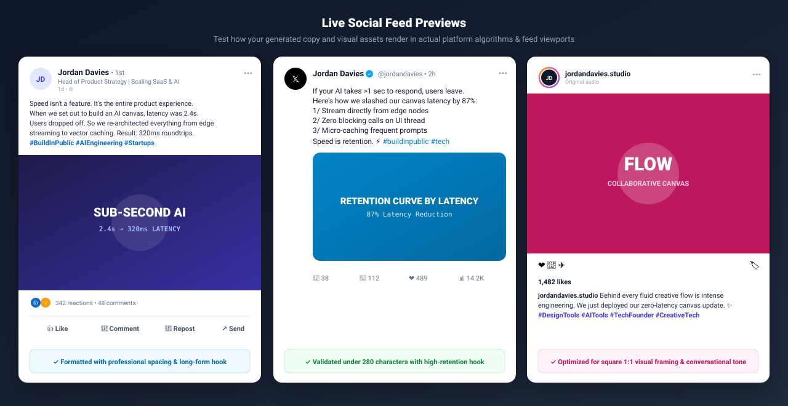
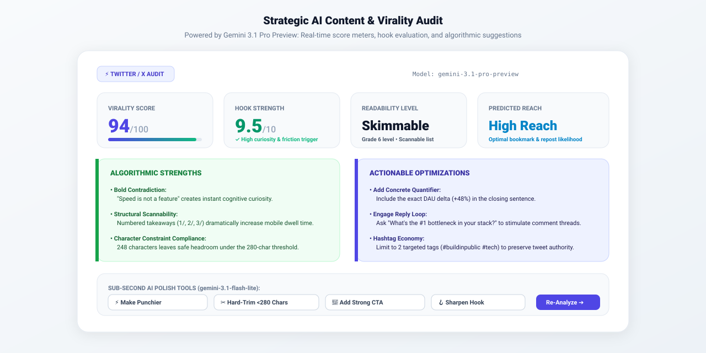

# 🚀 Cross-Platform Social Media Content Generator

> An AI-powered, multi-platform content engine that transforms a single raw idea and desired tone into high-converting, tailored posts and platform-optimized visual assets for **LinkedIn**, **Twitter / X**, and **Instagram** simultaneously.

[](https://cross-platform-social-media-content-generator-517886466216.asia-southeast1.run.app/)
[](https://react.dev/)
[](https://www.typescriptlang.org/)
[](https://vitejs.dev/)
[](https://tailwindcss.com/)
[](https://ai.google.dev/)

---

## 🌐 Live Demo

🔗 **Official Deployment**: [https://cross-platform-social-media-content-generator-517886466216.asia-southeast1.run.app/](https://cross-platform-social-media-content-generator-517886466216.asia-southeast1.run.app/)

- **Cloud Run Production App**: [https://cross-platform-social-media-content-generator-517886466216.asia-southeast1.run.app/](https://cross-platform-social-media-content-generator-517886466216.asia-southeast1.run.app/)
- **AI Studio Shared Preview**: [https://ais-pre-u4afdmvqfwsoxzq2fqedgp-629351833193.asia-southeast1.run.app](https://ais-pre-u4afdmvqfwsoxzq2fqedgp-629351833193.asia-southeast1.run.app)
- **AI Studio Dev Preview**: [https://ais-dev-u4afdmvqfwsoxzq2fqedgp-629351833193.asia-southeast1.run.app](https://ais-dev-u4afdmvqfwsoxzq2fqedgp-629351833193.asia-southeast1.run.app)

---

## 📸 Screenshots & Previews

### 1. Unified Multi-Platform Dashboard
Transform a single idea into tailored posts across LinkedIn, Twitter / X, and Instagram with matched aspect-ratio visuals in seconds:



---

### 2. Live Platform Feed Previews (Mockup Mode)
Switch between draft editing and true-to-life platform feed mockups with author badges, formatting conventions, reaction bars, and engagement metrics:



---

### 3. Strategic Content & Virality Audit (`gemini-3.1-pro-preview`)
Run algorithmic evaluations before posting to verify hook strength, readability score, predicted reach, and receive actionable tips plus sub-second polish actions:



---

## 📖 Table of Contents

- [Live Demo](#-live-demo)
- [Screenshots & Previews](#-screenshots--previews)
- [Overview](#-overview)
- [Key Features](#-key-features)
- [Multi-Model Gemini Architecture](#-multi-model-gemini-architecture)
- [Interactive UI & Platform Mockups](#-interactive-ui--platform-mockups)
- [Tech Stack](#-tech-stack)
- [API Architecture & Endpoints](#-api-architecture--endpoints)
- [Getting Started](#-getting-started)
- [Configuration & Environment Variables](#-configuration--environment-variables)
- [Project Structure](#-project-structure)
- [Production Deployment](#-production-deployment)
- [License](#-license)

---

## 🌟 Overview

Content marketing often requires repurposing one core concept across multiple channels with wildly different cultures, algorithms, formatting conventions, and media constraints. Manually rewriting a post for LinkedIn, condensing it for Twitter/X, formatting captions for Instagram, and designing accompanying banners in different aspect ratios is tedious and time-consuming.

**Cross-Platform Social Media Content Generator** solves this end-to-end:
1. **Input Any Concept**: Announcements, product launches, case studies, engineering insights, or personal stories.
2. **Choose a Voice**: Select from 5 calibrated tones (Professional, Casual, Inspiring, High-Energy, or Educational).
3. **Instant Synthesis**: In seconds, obtain:
   - **LinkedIn**: Long-form structured narrative with an opening hook, clean spacing, bullet points, key takeaways, and professional hashtags.
   - **Twitter / X**: Ultra-punchy, high-shareability post strictly tracked against the 280-character limit with viral hooks.
   - **Instagram**: Visual-first storytelling caption with strategic line breaks, emojis, engagement call-to-actions, and curated hashtags.
   - **Platform-Tailored Visual Assets**: Custom graphics generated in optimal aspect ratios (`16:9` for LinkedIn/Twitter, `1:1` for Instagram, or custom ratios like `4:3`, `9:16`, `21:9`).

---

## ✨ Key Features

### 1. Simultaneous Multi-Platform Generation
- **Channel-Specific Copywriting**: Automatically formats tone, length, hashtags, and layout according to each platform's culture and algorithmic preferences.
- **Hook Extraction**: Identifies and highlights the opening hook for each post to ensure maximum scroll-stopping power.
- **Platform Tips**: Displays tactical advice for maximizing algorithmic reach on each specific channel.

### 2. High-Resolution Visual Studio & Aspect Ratio Engine
- **Dedicated Visual per Platform**: Automatically crafts bespoke image prompts matching the context and style of each post.
- **Aspect Ratio Selector**: Full support for `1:1`, `16:9`, `4:3`, `9:16`, `3:4`, `2:3`, `3:2`, and `21:9`.
- **Resolution Control**: Toggle between **1K**, **2K**, and **4K** generation.
- **Custom Image Prompt Editor**: Tweak and refine prompt instructions before re-generating.
- **Full-Screen Lightbox**: Inspect generated assets in high resolution with prompt copying and direct PNG download.
- **Fallback Visual Engine**: Intelligent SVG fallback generator guarantees visual feedback even if API quota limits are reached.

### 3. Real-World Social Feed Mockups
Toggle between draft editing and true-to-life platform mockups to see exactly how your post will render on feeds:
- **LinkedIn Mockup**: Author badge, connection degree, headline, timestamp, full body text, media banner, reaction counts, and action buttons.
- **Twitter / X Mockup**: Verified avatar, handle, post text, embedded card/media, engagement metrics (replies, retweets, likes, bookmarks, views).
- **Instagram Mockup**: Profile header, audio tag, full media container, like/comment/share bar, like counts, and expandable caption formatting.

### 4. Fast AI Polish Bar (`gemini-3.1-flash-lite`)
Quickly refine copy on the fly with sub-second intelligent actions:
- ⚡ **Make punchier**: Injects high-energy phrasing and eliminates fluff.
- ✂️ **Trim to <280 chars**: Hard-constrains tweets while retaining core punch.
- 🎯 **Add strong CTA**: Appends questions or engagement prompts.
- 🪝 **Sharpen hook**: Re-crafts opening lines for curiosity and click-through.

### 5. Strategic Algorithmic Audit (`gemini-3.1-pro-preview`)
Run a deep virality audit before publishing:
- **Algorithm Score** (0–100 scale)
- **Hook Rating** (0–10 scale)
- **Readability Assessment**
- **Predicted Reach / Engagement Level**
- **Key Algorithmic Strengths**
- **Actionable Optimization Suggestions**

### 6. Workflow & Productivity Controls
- **Click-to-Edit**: Edit any post copy directly in place without breaking synchronization.
- **Live Character Counter**: Dynamic character counter with visual warning if Twitter copy exceeds 280 characters.
- **One-Click Copying**: Copy individual posts with hashtags included or use the **"Copy All 3 Posts"** master button.
- **Session History Drawer**: Local storage persistence allows you to reload and inspect previous content generation sessions anytime.
- **Responsive Layout**: 3-column side-by-side comparison on desktop; smooth tabbed switcher on mobile devices.

---

## 🧠 Multi-Model Gemini Architecture

This project leverages Google's **Gemini 3 family of models** via the official `@google/genai` TypeScript SDK:

| Model | Role in Application | Why Selected |
| :--- | :--- | :--- |
| **`gemini-3.5-flash`** | Multi-platform content synthesis & JSON structuring | Exceptional multi-turn reasoning, structured JSON schema outputs, and high throughput. |
| **`gemini-3-pro-image-preview`** | High-fidelity social media visual generation | Supports multi-resolution (1K, 2K, 4K) output and diverse native aspect ratios with rich creative detail. |
| **`gemini-3.1-flash-image-preview`** | Fast visual asset generation alternative | Lower latency alternative for rapid image prototyping. |
| **`gemini-3.1-flash-lite`** | Fast inline copy polishing & trimming | Sub-second latency for real-time text adjustments (punchy tone, trimming, CTAs). |
| **`gemini-3.1-pro-preview`** | In-depth strategic content & virality audits | Advanced analytical capabilities for scoring hooks, virality potential, and platform nuances. |

---

## 💻 Tech Stack

### Frontend
- **React 19**: Modern functional components, hooks, and clean state handling.
- **TypeScript 5.8**: End-to-end type safety across client and server.
- **Vite 6.2**: Lightning-fast build tooling and HMR support.
- **Tailwind CSS v4**: Ultra-modern utility-first styling with custom typography and color hierarchies.
- **Lucide React**: Clean, accessible vector icons.
- **Motion**: Fluid animations and UI transitions.

### Backend
- **Node.js & Express 4.21**: Full-stack proxy server ensuring all secrets and API keys stay secure server-side.
- **`@google/genai` SDK**: Official Google Gen AI TypeScript SDK.
- **`esbuild`**: High-speed backend bundling into a self-contained production executable (`dist/server.cjs`).
- **`dotenv`**: Environment variable management.

---

## 🔌 API Architecture & Endpoints

All Gemini API calls are securely proxied through Express server routes:

### `POST /api/generate`
Generates LinkedIn, Twitter, and Instagram posts simultaneously with custom image prompts and platform tips.
- **Request Body**:
  ```json
  {
    "idea": "We just launched our real-time collaboration canvas feature...",
    "tone": "inspiring"
  }
  ```
- **Response**:
  ```json
  {
    "idea": "...",
    "tone": "inspiring",
    "posts": {
      "linkedin": { "hook": "...", "content": "...", "hashtags": [...], "aspectRatio": "16:9", ... },
      "twitter": { "hook": "...", "content": "...", "hashtags": [...], "aspectRatio": "16:9", ... },
      "instagram": { "hook": "...", "content": "...", "hashtags": [...], "aspectRatio": "1:1", ... }
    }
  }
  ```

### `POST /api/generate-image`
Generates high-resolution platform visuals based on prompt, aspect ratio, and resolution settings.
- **Request Body**:
  ```json
  {
    "prompt": "Futuristic collaborative workspace with glowing holographic UI...",
    "platform": "linkedin",
    "aspectRatio": "16:9",
    "imageSize": "1K",
    "model": "gemini-3-pro-image-preview"
  }
  ```
- **Response**:
  ```json
  {
    "imageUrl": "data:image/png;base64,...",
    "prompt": "...",
    "aspectRatio": "16:9",
    "imageSize": "1K",
    "platform": "linkedin"
  }
  ```

### `POST /api/edit-content`
Performs rapid edits using `gemini-3.1-flash-lite`.
- **Request Body**:
  ```json
  {
    "platform": "twitter",
    "currentContent": "Here is our draft text...",
    "instruction": "Make this post significantly punchier with high-energy wording"
  }
  ```

### `POST /api/analyze-post`
Executes an in-depth virality and engagement audit with `gemini-3.1-pro-preview`.
- **Request Body**:
  ```json
  {
    "platform": "linkedin",
    "content": "Draft content...",
    "tone": "professional"
  }
  ```

### `GET /api/health`
Health check route confirming API connectivity.

---

## 🚀 Getting Started

### Prerequisites
- **Node.js**: v20.x or higher
- **npm** or **bun**
- **Google Gemini API Key**: Obtain from [Google AI Studio](https://aistudio.google.com/)

### Installation

1. **Clone the repository**:
   ```bash
   git clone https://github.com/your-username/cross-platform-content-generator.git
   cd cross-platform-content-generator
   ```

2. **Install dependencies**:
   ```bash
   npm install
   ```

3. **Configure environment variables**:
   Create a `.env` file in the root directory (or copy from `.env.example`):
   ```bash
   cp .env.example .env
   ```
   Add your Gemini API Key:
   ```env
   GEMINI_API_KEY=your_gemini_api_key_here
   ```

4. **Start the development server**:
   ```bash
   npm run dev
   ```
   The application will start on **`http://localhost:3000`** with live backend endpoints and Vite middleware.

---

## 🛠️ Configuration & Environment Variables

| Variable | Required | Description |
| :--- | :---: | :--- |
| `GEMINI_API_KEY` | **Yes** | Your Google Gemini API Key. Never exposed to the browser. |
| `NODE_ENV` | No | Set to `production` in container deployments. |
| `PORT` | No | Defaults to `3000`. |

---

## 📂 Project Structure

```
├── .env.example              # Sample environment configuration
├── index.html                # Main HTML entry point with metadata tags
├── metadata.json             # AI Studio configuration & permissions
├── package.json              # Project dependencies & build scripts
├── server.ts                 # Express full-stack server & Gemini API proxy
├── src/
│   ├── App.tsx               # Main application component & state orchestrator
│   ├── data.ts               # Sample ideas, tone options, aspect ratios, etc.
│   ├── index.css             # Tailwind CSS entry point
│   ├── main.tsx              # React DOM render root
│   ├── types.ts              # TypeScript interfaces, types, and enums
│   └── components/
│       ├── Header.tsx        # Navigation bar & session history button
│       ├── HistoryDrawer.tsx # Slide-out drawer with persisted generation history
│       ├── IdeaInput.tsx     # Topic input, tone selector, and advanced settings
│       ├── ImageModal.tsx    # High-resolution lightbox & image downloader
│       ├── PlatformCard.tsx  # Card container with Editor, Mockup & Audit tabs
│       └── PlatformMockup.tsx# Real-world LinkedIn, Twitter, and Instagram feed mockups
├── tsconfig.json             # TypeScript compiler settings
└── vite.config.ts            # Vite bundler & Tailwind CSS plugin configuration
```

---

## 📦 Production Deployment

### Build Command
Compile the client assets with Vite and bundle the backend server with `esbuild`:
```bash
npm run build
```

This generates:
- `dist/`: Optimized production static client files.
- `dist/server.cjs`: Standalone bundled CommonJS Node.js server with source maps.

### Run in Production
```bash
npm start
```

### Docker / Cloud Run
The project is container-ready and runs seamlessly on Google Cloud Run:
```dockerfile
FROM node:20-slim
WORKDIR /app
COPY package*.json ./
RUN npm ci --production=false
COPY . .
RUN npm run build
EXPOSE 3000
CMD ["npm", "start"]
```

---

## 📄 License

Distributed under the **MIT License**. See `LICENSE` for more information.

---

## 🤝 Acknowledgments

- Built with [Google AI Studio](https://aistudio.google.com/) and powered by Google DeepMind's Gemini models.
- Icons by [Lucide Icons](https://lucide.dev/).
- UI styled with [Tailwind CSS](https://tailwindcss.com/).
